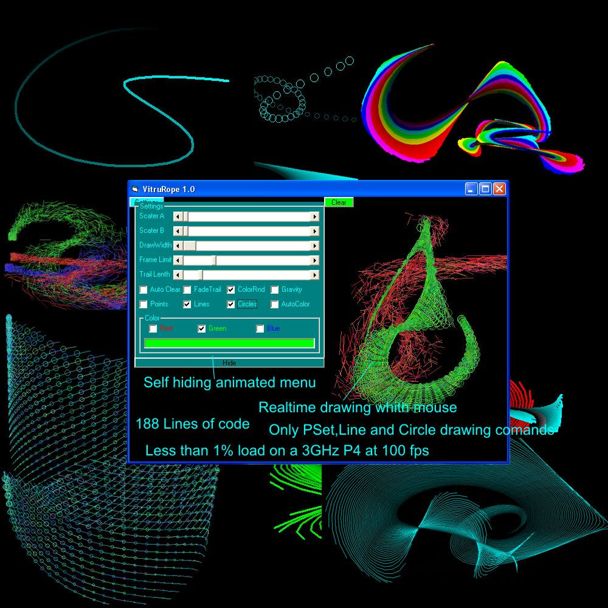



## Amazing stuff whith Line and PSet

### Description

Ive ben fooling around whith the Pset,Line and Circle comands in VB 6.0 and i got some good stuff out of it.And all the math for it is +,-,* and /.

It basicly alows you to make all sotrs of paterns whith the mouse.All of the ones in the screenshot ware made in the program in like max 20 seconds each.

I also was playing arund whith the setings menu it pops out when you drag over and pops bak in when you drag you mouse back on the main part of the form.This should be useful for those that use low resolutions.

So what do you pepole think of this hour of fooling around?
 
### More Info
 

             |
---                |---
**Submitted On**   |2006-11-07 17:20:02
**By**             |[Berni](https://github.com/Planet-Source-Code/PSCIndex/blob/master/ByAuthor/berni.md)
**Level**          |Intermediate
**User Rating**    |4.7 (14 globes from 3 users)
**Compatibility**  |VB 5\.0, VB 6\.0
**Category**       |[Graphics](https://github.com/Planet-Source-Code/PSCIndex/blob/master/ByCategory/graphics__1-46.md)
**World**          |[Visual Basic](https://github.com/Planet-Source-Code/PSCIndex/blob/master/ByWorld/visual-basic.md)
**Archive File**   |[Amazing\_st2029681172006\.zip](https://github.com/Planet-Source-Code/berni-amazing-stuff-whith-line-and-pset__1-67032/archive/master.zip)

